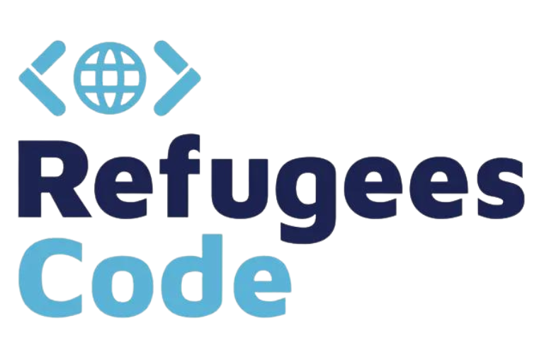

# Presentation - November 2023

##  Hi there! Welcome to [Refugees Code](https://refugeescode.org/) 👩‍💻

Welcome to Refugees Code! From now on we'll try to guide you through the fundamentals of web development with the main and only purpose that you can land a job in the IT industry. We'll do our best to help you get a job, but it will also require a lot of work from your side. Bear in mind that we are here to help you, but it depends on your work and motivation. Let's coding! 💫 

Check the [issues](https://github.com/mfrcodingproject/Presentation-RC-nov23/issues) section on GitHub and present yourself.

## ⚡ Tech Stack

        